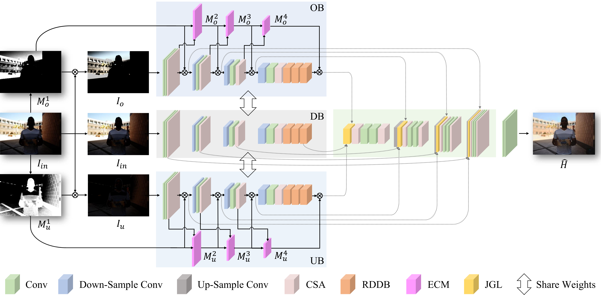

# EIN: Exposure-Induced Network for Single-Image HDR Reconstruction

> **Paper:** [EIN: Exposure-Induced Network for Single-Image HDR Reconstruction](https://dl.acm.org/doi/10.1145/3763240)  
> **Authors:** [Yue Liu](https://scholar.google.com/citations?user=5VN9qkYAAAAJ&hl=zh-CN)<sup>1</sup>, [Zhangkai Ni](https://scholar.google.com/citations?user=68IcrE4AAAAJ&hl=en)<sup>2</sup>, [Peilin Chen](https://scholar.google.com/citations?user=b9k152sAAAAJ&hl=en)<sup>3</sup>, [Shiqi Wang](https://scholar.google.com/citations?user=Pr7s2VUAAAAJ&hl=en)<sup>3</sup>, [Xinfeng Zhang](https://scholar.google.com/citations?user=KQB-cKAAAAAJ&hl=en)<sup>1</sup>, [Hanli Wang](https://scholar.google.com/citations?user=WioFu64AAAAJ&hl=zh-CN)<sup>2</sup>, [Sam Kwong](https://scholar.google.com/citations?user=_PVI6EAAAAAJ&hl=zh-CN)<sup>4</sup>  
> **Affiliations:**  
> <sup>1</sup>University of Chinese Academy of Sciences,  
> <sup>2</sup>Tongji University,  
> <sup>3</sup>City University of Hong Kong,  
> <sup>4</sup>Lingnan University
---

## 1. Introduction

This repository is the official implementation of the paper **"EIN: Exposure-Induced Network for Single-Image HDR Reconstruction"**. We introduce an **Exposure-Induced Network (EIN)** to recover high dynamic range (HDR) images from single low dynamic range (SDR) inputs. By modeling exposure-induced representations, EIN effectively restores overexposed and underexposed regions, achieving superior perceptual quality in HDR reconstruction.





## 2. Environment Setup

We recommend using Python virtual environments or Conda for dependency management.

```bash
# Clone the repository
git clone https://github.com/Yliu724/EIN.git
cd EIN

# Install dependencies
pip install -r requirements.txt
```

Ensure CUDA and the compatible version of PyTorch are properly installed for GPU acceleration.

---

## 3. Training

Start training the model with:

```bash
python main.py --train True --root_path ./data
```

Optional parameters:
- `--max_epoch`: number of training epochs (default: 200)  
- `--batch_size`: batch size (default: 8)  
- `--lr`: learning rate (default: 1e-4)


#### Structure of the Training Dataset

```
data/
├── train_SDR/  
     ├── img1.png
     ├── img2.png            
├── train_HDR/  
     ├── img1.hdr
     ├── img2.hdr
├── valid_SDR/ 
     ├── img1.png
     ├── img2.png    
├── valid_HDR/ 
     ├── img1.hdr
     ├── img2.hdr          
├── train.xls
├── valid.xls
```
The content of the excel files (`train.xls` and `valid.xls`) should be formatted as follows:

| HDR      | SDR      |
|----------|----------|
| img1.hdr | img1.png |
| img2.hdr | img2.png |
| ...      | ...      |
Make sure to replace `img1.png`, `img1.hdr`, etc., with your actual image filenames.

---

## 4. Testing

After training, run the following command to test the model:

```bash
python test.py --train False --test_SDR_path ./test_SDR --out_HDR_path ./test_results
```

All reconstructed HDR results will be saved under the `./test_results` directory.


## 5. Citation

If you use this code or find our work helpful, please cite our paper:

```bibtex
@article{liu2025ein,
author = {Liu, Yue and Ni, Zhangkai and Chen, Peilin and Wang, Shiqi and Zhang, Xinfeng and Wang, Hanli and Kwong, Sam},
title = {EIN: Exposure-Induced Network for Single-Image HDR Reconstruction},
year = {2025},
volume = {21},
number = {10},
doi = {10.1145/3763240},
journal={ACM Transactions on Multimedia Computing, Communications and Applications},
```

---

## 6. Acknowledgements

We gratefully acknowledge the following datasets used for training and evaluation in this work:

- [SI-HDR](https://www.repository.cam.ac.uk/items/c02ccdde-db20-4acd-8941-7816ef6b7dc7) and [HDR-Eye Dataset](https://www.epfl.ch/labs/mmspg/downloads/hdr-eye/) — for HDR reconstruction benchmarking.  
- [Fairchild Dataset](http://markfairchild.org/HDR.html), [The Laval HDR databases](http://hdrdb.com/), [HDR Images of Natural Scenes](https://exhibits.stanford.edu/data/catalog/sz929jt3255), Testset of the [HDRCNN](https://computergraphics.on.liu.se/hdrcnn/), [ACM TOG paper](https://github.com/TH3CHARLie/deep-high-dynamic-range), and [Poly Haven](https://polyhaven.com/)  — for supervised HDR training.  
- [Deep reverse tone mapping](https://dl.acm.org/doi/10.1145/3130800.3130834) — for exposure variation generation.  

We sincerely thank the authors and organizations for providing these valuable datasets to the research community.


---

## 7. Contact

For questions or collaborations, please contact:

**Yue Liu**  
[liuyue@ucas.ac.cn](mailto:liuyue@ucas.ac.cn)

---

## License

This project is released under the [MIT License](LICENSE).
